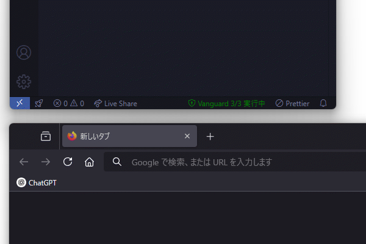

# Kanolab Vanguard

この拡張機能は、編集中のファイルの監視やブラウザの監視により、生成AIを用いた不正行為を検知するサービスです。\
This extension is a service that detects cheating using generated AI by monitoring files being edited and by monitoring the browser.

> [!IMPORTANT]
> すべてのログは改ざん検知のためのハッシュを出力するため、ログファイルの編集、削除を検出することができます。\
> All logs output a hash for tamper detection, therefore edits and deletions of log files can be detected.

## ロガー

### ブラウザロガー (BrowserLogger)

このロガーは、ブラウザ上で主要な生成AIを使用したことを検知することができます。ブラウザのCookieやパスワードなどの機密情報には一切アクセスせず、ローカル内で処理されるため、生成AIの使用有無ならびにそのタブのタイトルのみをログに出力します。\
This logger can detect the use of major generative AIs on the browser. It does not access any sensitive information such as browser cookies or passwords, and is processed locally, logging only the use of the generated AI and its tab title.

#### 検知可能な生成AI (Detectable Generative AIs)

- [ChatGPT](https://chatgpt.com/)
- [Claude](https://claude.ai/)
- [Gemini](https://gemini.google.com/)
- [Perplexity](https://www.perplexity.ai/)
- [Microsoft Copilot](https://copilot.microsoft.com/)
- [DeepSeek](https://chat.deepseek.com/)
- [NotebookLM](https://notebooklm.google.com/)

#### 検出可能なブラウザならびにOS (Detectable Browsers and OS)

| Browser / OS    | Windows | macOS | Linux | WSL |
| --------------- | ------- | ----- | ----- | --- |
| Google Chrome   | ✅       | ✅     | ✅     | ✅   |
| Microsoft Edge  | ✅       | ✅     | ✅     | ✅   |
| Mozilla Firefox | ✅       | ❌     | ✅     | ✅   |
| Safari          | -       | ✅     | -     | -   |

### 差分ロガー (DiffLogger)

このロガーは、編集中のファイルの差分を定期的にログに出力することで、クリップボードによる貼付けを検知することができます。\
This logger can detect clipboard pasting by periodically logging the differences in the file being edited.

### キーロガー (KeyLogger)

このロガーは、編集中のファイルに対するキー入力をログに出力することで、GitHub CopilotやContinueなどの生成AIによるプログラミング補助の拡張機能を使用したことを検知することができます。編集中のファイルのみであるため、ターミナルや他プログラム上のキー入力を収集することはありません。\
The logger logs keystrokes to the file being edited and can detect the use of generated AI programming assistance extensions such as GitHub Copilot and Continue. It does not collect keystrokes on the terminal or other programs, as it is only the file being edited.

Copyright (c) 2024 Yuto Sahashi (Kano Laboratory)
